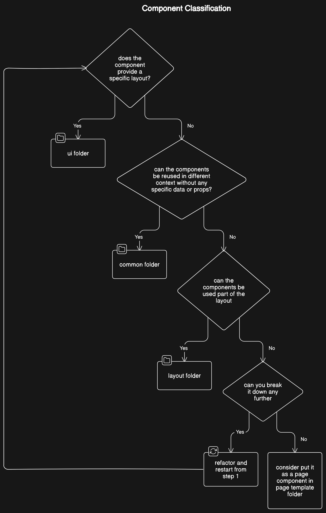

# create-opac Template

## Introduction

This is the React repository for a OPAC Template. Although it's possible, please use this repository
as a boilerplate/guideline rather than a final version of your application. This project is designed
with the intention to be highly customizable and extensible and for that reason, everything was
built to be generic and easy to modify.

## Feature

-   ✅Search (Union, single)
-   ✅Advanced search
-   ✅Bookmark record
-   ✅Permanent record URL
-   ✅Email bookmark
-   ✅User authentication
-   ✅Request
-   ✅Enquiry

## Getting Started

To install the repository, please make sure your environment has the latest version of Node or at
least version 21.x

You will also need to have these following:

-   [git](https://git-scm.com/downloads): Version control
-   [pnpm](https://pnpm.io/installation): Package manager
-   [docsify](https://docsify.js.org/): Document generator

To clone the repository, simply run the following from your command line. This one will clone the
project without having the existing history commits.

```shell
git clone --depth 3 -b main https://github.com/gitminisis/create_opac
```

Another approach is to do a regular clone and checkout to a new branch

```shell
git clone https://github.com/gitminisis/create_opac
```

```shell
git checkout -b new_branch
```

Under the root directory, run npm install

```shell
cd create_opac
```

```shell
pnpm setup
```

Once everything is installed, you have a couple of options to choose here

-   `pnpm run start`: To run project in development without needing to connect to the SMA side. This
    also supports HMR while making changes to the code base

-   `pnpm run dev`: Similarly to `start` but this one will create a `/dist` folder (development
    mode) which will serve as bundled js files that will be used for the SMA reports and your OPAC.
    This also supports HMR.

-   `pnpm run build`: Build a production output folder for the project.

-   `pnpm run lint`: Run ESLint to check for any unused imports, potential errors, type mismatching,
    etc.

-   `pnpm run format`: Format the whole repo

-   `pnpm run theme`: To generate the `index.css` which is required when a new css theme file is
    added.

-   `pnpm run schema`: To generate JSON schema for every file in `/constants` folder which are
    required for the CMS dashboard

-   `pnpm run doc`: To view the docs on a webpage

## Setup the backend

### IIS

### MWI

## Project Structure

Explanation of the directory structure of the project and the purpose of each folder/file. This may
include folders like `src` (source code), `public` (static assets), `node_modules` (dependencies),
etc.

```
── src                          Repository source code
│   ├── assets                  Media files
│   ├── components              React components
│   │   ├── common              Custom components that are built from ui components
│   │   ├── layouts             Page layout
│   │   ├── page-template       Pages for the OPAC
│   │   └── ui                  shadcn-ui components
│   ├── constants               JSON files that store the pages data
│   ├── hooks                   Custom hooks
│   ├── lib                     External libraries, helper functions, etc.
│   ├── providers               Providers for any React.Context
│   ├── router                  Routes handler for the project
│   ├── schema                  Generated JSON schema from /constants folder
│   ├── store                   State management library store
│   ├── styles                  Styling
│   └── themes                  Custom theme
└── tools                       Code generation tools
```

## Components

Every building block components for the UI will be put inside the `components/` folder. As you
continue to add more components to the OPAC, keep in mind each of the sub folders serve a different
purpose. Please refer to this diagram below while deciding where your React component lives.

<span style="height:200px"></span>

Another way to decide where to put your React component should be is by asking these following
questions

-   Are you building a page ? => `/page-template`
-   Will I need to reuse this components on different pages with different data ? => `/layout` or
    `/common`
    -   Does this component take any data from the `constants` folder
        -   Yes: `/layout`
        -   No: `/common`
-   Otherwise, `/ui` is for headless UI component, consider this if your component checks out the
    following:
    -   Minimum styling and easy to customize
    -   Have no dependencies on any other components (if it does, it can only import from some from
        `/ui` itself and only the neccessary ones)

## Routing

Information on how routing is handled in the project, especially if React Router or any other
routing library is used. This could include how to define routes, navigate between them, and pass
parameters.

## State Management

Explanation of how state is managed in the application, whether it's through React's built-in state
management or external libraries like Redux, MobX, or Context API.

## Styling

Guidelines on how styling is applied in the project, including the use of CSS, CSS-in-JS libraries
like styled-components, or CSS preprocessors like Sass or Less.

## API Integration

Documentation on how the application communicates with backend APIs, including examples of making
HTTP requests using libraries like Axios or the built-in `fetch` API.

## Testing

Information on testing methodologies and tools used in the project, such as Jest and React Testing
Library, including examples of writing unit tests and integration tests for React components.

## Deployment

Instructions on how to build and deploy the project to production, covering topics like optimizing
assets, configuring environment variables, and deploying to hosting services like Netlify, Vercel,
or AWS.

## Contributing

Guidelines for contributing to the project, including how to report bugs, request features, and
submit code changes (e.g., through pull requests).

## Troubleshooting

Common issues and their solutions, FAQs, and troubleshooting tips for developers encountering
problems while working on or running the project.

## Resources

Links to additional resources such as official React documentation, tutorials, blog posts, and
community forums for further learning and support.
